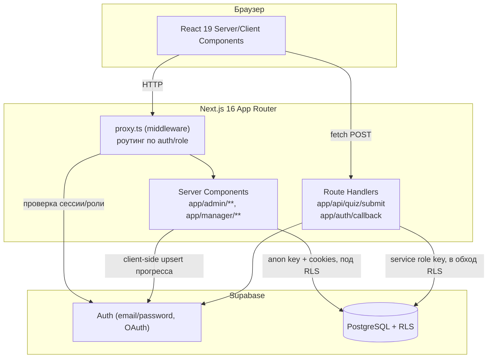
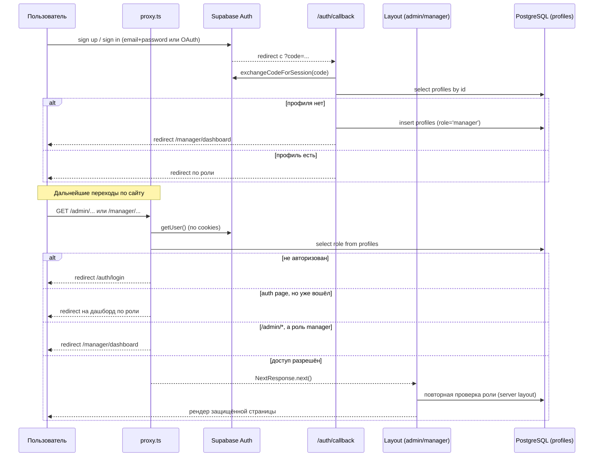
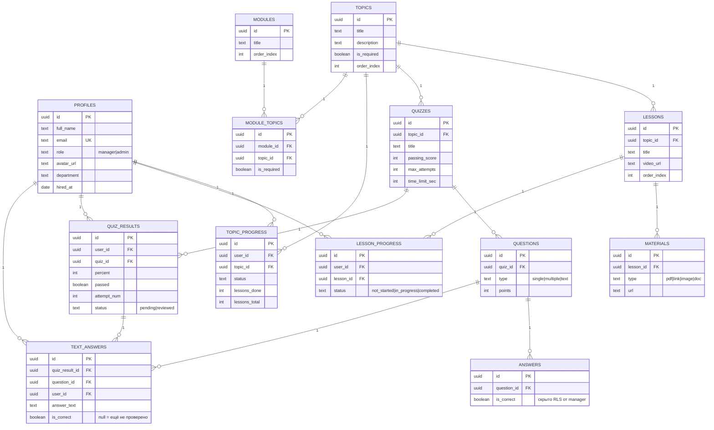
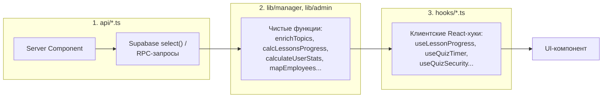
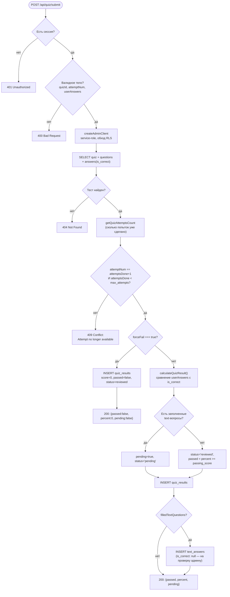
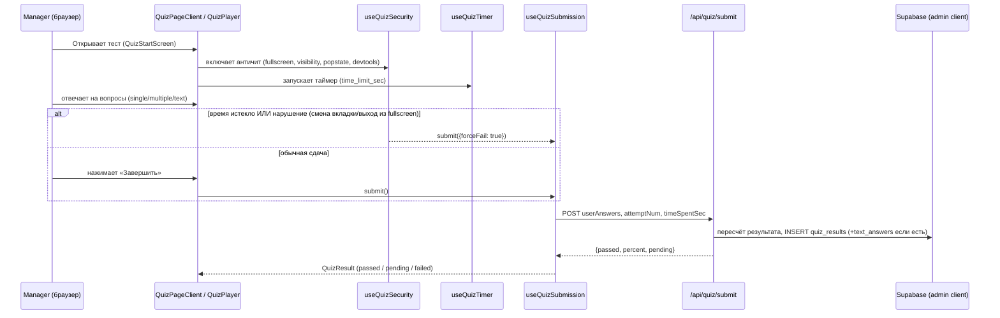

# Learning Board — техническая документация

Внутренняя платформа онбординга и обучения сотрудников. Пользователь с ролью **manager** проходит темы, уроки и тесты; пользователь с ролью **admin** управляет контентом, сотрудниками, модулями и проверяет текстовые ответы.

---

## Содержание

1. [Стек технологий](#1-стек-технологий)
2. [Архитектура](#2-архитектура)
3. [Структура проекта](#3-структура-проекта)
4. [Роли и авторизация](#4-роли-и-авторизация)
5. [Схема базы данных](#5-схема-базы-данных)
6. [Row Level Security (RLS)](#6-row-level-security-rls)
7. [Слой данных (api / lib / hooks)](#7-слой-данных-api--lib--hooks)
8. [API-роуты](#8-api-роуты)
9. [Ключевые пользовательские сценарии](#9-ключевые-пользовательские-сценарии)
10. [Компонентная карта UI](#10-компонентная-карта-ui)
11. [Установка и запуск](#11-установка-и-запуск)
12. [Переменные окружения](#12-переменные-окружения)
13. [Деплой](#13-деплой)
14. [Проверка перед деплоем](#14-проверка-перед-деплоем)
15. [Заметки по безопасности](#15-заметки-по-безопасности)
16. [Известные особенности кода](#16-известные-особенности-кода)

---

## 1. Стек технологий

| Слой | Технология | Версия |
|---|---|---|
| Framework | Next.js (App Router, Server Components, Route Handlers, Proxy) | 16.2.4 |
| UI | React | 19.2.4 |
| Язык | TypeScript | ^5 |
| Стилизация | CSS Modules + Tailwind (postcss) | Tailwind ^4 |
| Иконки | lucide-react | ^1.17.0 |
| Скелетоны загрузки | react-loading-skeleton | ^3.5.0 |
| Backend / БД | Supabase (PostgreSQL, Auth, Storage через RLS) | @supabase/ssr ^0.10.2, @supabase/supabase-js ^2.105.3 |
| Линтер | ESLint (eslint-config-next) | ^9 |

Скрипты `package.json`:

```bash
npm run dev     # next dev — режим разработки
npm run build   # next build — production-сборка
npm run start   # next start — production-сервер
npm run lint    # eslint
```

---

## 2. Архитектура



**Принцип разделения ответственности:**

- **`proxy.ts`** — быстрый «оптимистичный» редирект на уровне edge-мидлвара: неавторизованных отправляет на `/auth/login`, авторизованных с auth-страниц — на дашборд по роли, менеджеров — из `/admin/*`.
- **Server Layouts** (`app/admin/layout.tsx`, `app/manager/layout.tsx`) — вторичная, «настоящая» проверка авторизации и роли перед рендером защищённой области (проверка в proxy — не единственная линия защиты).
- **Anon-клиент** (`lib/supabase/server.ts`, `lib/supabase/client.ts`) — используется почти везде, все запросы идут под RLS-политиками от лица текущего пользователя.
- **Admin-клиент** (`lib/supabase/admin.ts`, `SUPABASE_SERVICE_ROLE_KEY`) — используется **только** на сервере в `app/api/quiz/submit/route.ts`, чтобы прочитать `answers.is_correct` (RLS это запрещает обычным юзерам) и посчитать результат теста, не раскрывая правильные ответы клиенту.

---

## 3. Структура проекта

```
learning-board-main/
├── api/                       # Server-side data-fetch функции (Supabase-запросы)
│   ├── getDashboardData.ts
│   ├── getEmployeesUserPage.ts
│   ├── getGlobalStats.ts
│   ├── getQuizResults.ts
│   ├── getQuizzes.ts
│   ├── getTopicPageData.ts
│   ├── getTopicsData.ts
│   └── getUserDetails.ts
├── app/                        # Next.js App Router
│   ├── admin/                  # Защищённая зона администратора
│   │   ├── dashboard/
│   │   ├── modules/
│   │   ├── reports/
│   │   ├── text-answers/       # проверка текстовых ответов
│   │   ├── topics/[id]/        # редактор темы (уроки, тест)
│   │   ├── topics/new/
│   │   ├── users/[id]/         # карточка сотрудника
│   │   └── layout.tsx          # guard: только role === 'admin'
│   ├── manager/                 # Защищённая зона сотрудника
│   │   ├── dashboard/
│   │   ├── modules/[id]/
│   │   ├── results/
│   │   ├── topics/[id]/
│   │   │   └── quiz/            # прохождение теста
│   │   └── layout.tsx           # guard: любой авторизованный
│   ├── api/quiz/submit/route.ts # POST — приём и проверка теста
│   ├── auth/
│   │   ├── callback/route.ts    # OAuth/magic-link callback
│   │   ├── login/page.tsx
│   │   └── register/page.tsx
│   ├── layout.tsx               # root layout
│   └── page.tsx                 # redirect → /auth/login
├── components/                  # UI-компоненты, сгруппированы по фиче
│   ├── adminManegerCard/        # карточки сотрудников (admin)
│   ├── adminManegerStat/        # статистика по сотруднику (admin)
│   ├── adminModules/            # управление модулями (admin)
│   ├── layout/                  # Sidebar, DashboardShell, фон
│   ├── managerDashboard/        # виджеты дашборда менеджера
│   ├── managerModules/          # просмотр модуля (manager)
│   ├── managerQuiz/             # прохождение теста (manager)
│   ├── managerTopicPage/        # страница темы (manager)
│   ├── managerTopics/           # список тем (manager)
│   ├── skeleton/                # скелетоны загрузки
│   └── video/                   # видеоплеер урока
├── hooks/                       # клиентские React-хуки
├── lib/
│   ├── admin/                   # чистые функции-калькуляторы для admin
│   ├── manager/                 # чистые функции-калькуляторы + мутации для manager
│   └── supabase/                # фабрики Supabase-клиентов (browser/server/admin)
├── supabase/migrations/
│   └── 001_initial_schema.sql   # единственная миграция — вся схема + RLS
├── styles/globals.css
├── types/index.ts               # все TS-типы (DB + UI)
├── proxy.ts                     # Next.js middleware
└── next.config.ts
```

---

## 4. Роли и авторизация

| Роль | Доступ | Начальная страница |
|---|---|---|
| `manager` (по умолчанию для новых пользователей) | `/manager/*` — темы, уроки, тесты, свои результаты | `/manager/dashboard` |
| `admin` | `/admin/*` + всё, что доступно manager | `/admin/dashboard` |

**Поток регистрации/входа:**



Автоматическое создание профиля дублируется в трёх местах для надёжности:

1. **SQL-триггер `handle_new_user()`** на `auth.users` (миграция) — основной путь, роль `manager` по умолчанию.
2. **`app/auth/callback/route.ts`** — на случай если триггер ещё не сработал/OAuth-флоу.
3. **`app/manager/layout.tsx`** — финальный fallback перед рендером, если профиля всё ещё нет.

Первый администратор назначается вручную SQL-запросом (см. [раздел 11](#11-установка-и-запуск)).

---

## 5. Схема базы данных



Все таблицы (кроме `materials`, `answers`, `module_topics`) имеют `created_at`; таблицы с изменяемым состоянием (`profiles`, `topics`, `lessons`, `quizzes`, `questions`, `lesson_progress`, `topic_progress`, `modules`) дополнительно имеют `updated_at`, автоматически обновляемый триггером `set_updated_at()`.

Уникальные ограничения:
- `lesson_progress (user_id, lesson_id)` — один статус прогресса на пару юзер/урок.
- `topic_progress (user_id, topic_id)` — один агрегат прогресса на пару юзер/тема.
- `module_topics (module_id, topic_id)` — тема не дублируется внутри модуля.

Индексы для типичных выборок: `lessons(topic_id, order_index)`, `questions(quiz_id, order_index)`, `answers(question_id, order_index)`, `lesson_progress(user_id)`, `topic_progress(user_id)`, `quiz_results(user_id, quiz_id, attempt_num)`, `text_answers(is_correct, created_at)` (для очереди на проверку), `module_topics(module_id, order_index)`.

---

## 6. Row Level Security (RLS)

RLS включён на всех таблицах. Ключевая функция-хелпер:

```sql
is_admin() → boolean   -- SECURITY DEFINER, проверяет profiles.role = 'admin' для auth.uid()
```

| Таблица | SELECT | INSERT/UPDATE |
|---|---|---|
| `profiles` | своя запись или admin | своя запись (insert), своя или admin (update) |
| `topics / lessons / materials / quizzes / questions / modules / module_topics` | любой `authenticated` | только admin |
| `answers` | **только admin** (`is_correct` не должен утекать к manager) | только admin |
| `lesson_progress / topic_progress` | своя запись или admin | insert/update — только своя запись (или admin на update) |
| `quiz_results` | своя запись или admin | insert — своя запись; update — только admin (проверка текстовых ответов) |
| `text_answers` | своя запись или admin | insert — своя запись; update — только admin |

Именно из-за политики `answers read admin only` для проверки теста используется **отдельный серверный клиент с service-role ключом** (см. раздел 8) — обычный anon-клиент от лица manager физически не сможет прочитать `is_correct`.

---

## 7. Слой данных (api / lib / hooks)

Проект придерживается трёхслойной модели для загрузки и обработки данных:



### `api/` — загрузка данных с сервера

| Файл | Назначение |
|---|---|
| `getDashboardData.ts` | Профиль + все темы (с прогрессом уроков) + 3 последних результата тестов для дашборда manager |
| `getTopicsData.ts` | Список всех тем с уроками, прогрессом, тестами, привязанным модулем |
| `getTopicPageData.ts` | Данные одной темы: тема, уроки (материалы + прогресс текущего юзера через `.eq('lesson_progress.user_id', userId)`), тест, последний результат теста; агрегирует всё через `buildTopicProgress` |
| `getQuizzes.ts` | `getQuizByTopicId` — тест с вопросами и ответами (используется на серверных страницах для admin) |
| `getQuizResults.ts` | `getQuizAttemptsCount` — подсчёт использованных попыток (нужен для контроля лимита `max_attempts`) |
| `getGlobalStats.ts` | Общее число тем и уроков (для карточек статистики) |
| `getEmployeesUserPage.ts` | Список сотрудников с прогрессом и результатами тестов — с guard-редиректом, если вызывающий не admin |
| `getUserDetails.ts` | Полная карточка сотрудника: прогресс по темам/урокам, все результаты тестов |

### `lib/manager/` — расчёты и мутации на стороне manager

| Файл | Назначение |
|---|---|
| `calcLessonsProgress.ts` | Считает `total/done/percent/isCompleted/isStarted` по урокам темы; поддерживает 2 режима (данные уже отфильтрованы по юзеру на SQL-уровне / нужно фильтровать вручную по массиву юзеров) |
| `calcTopicProgress.ts` | `enrichTopicsWithProgress` — обогащает список тем статусом (`not_started/in_progress/completed`) для конкретного юзера |
| `enrichTopics.ts` | Альтернативный обогатитель тем — используется там, где также нужны `hasQuiz`, цвет и название модуля |
| `buildTopicProgress.ts` | Сводит прогресс уроков + результат теста в единый `TopicProgress` (включая `quizDisplayStatus`: none/pending/reviewed/passed/failed) для страницы темы |
| `calculateQuizResult.ts` | Чистая функция подсчёта результата теста: сравнивает выбранные ответы с `is_correct`-ответами, считает `earned/maxScore/percent` |
| `sanitizeQuiz.ts` | Убирает `is_correct` из ответов и сортирует вопросы/ответы по `order_index` перед отдачей теста на клиент |
| `completeLesson.ts` | Client-side мутация: upsert `lesson_progress` (`completed`) → upsert `topic_progress` (пересчитывает статус темы) |
| `fullscreen.ts` | Обёртки над Fullscreen API (`enterFullscreen`/`exitFullscreen`) для защищённого прохождения теста |

### `lib/admin/` — расчёты для админской панели

| Файл | Назначение |
|---|---|
| `calculateUserStats.ts` | Статистика одного сотрудника: завершённые темы/уроки, средний балл по проверенным тестам |
| `mapEmployees.ts` | Обогащает список сотрудников процентом прохождения и средним баллом для таблицы/грида на `/admin/users` |

### `hooks/` — клиентские React-хуки

| Хук | Назначение |
|---|---|
| `useDashboard.ts` | `getDashboardViewModel` — server-side view-model для дашборда manager (агрегирует `getDashboardData` + `enrichTopicsWithProgress` + статистику по статусам) |
| `useLessonProgress.ts` | Optimistic-UI отметка урока как пройденного, с откатом при ошибке сети |
| `useTopicProgress.ts` | Локальное состояние прогресса темы (набор пройденных уроков, процент) на стороне клиента |
| `useQuizAccess.ts` | Вычисляет `canStartQuiz`/`isLocked` на основе статуса теста, попыток и завершённости уроков |
| `useQuizTimer.ts` | Обратный отсчёт времени теста с поддержкой сброса по `resetKey` и колбэком `onExpire` |
| `useQuizSecurity.ts` | Античит: реагирует на переключение вкладки, выход из полноэкранного режима, блокирует хоткеи DevTools (F12, Ctrl+Shift+I, Ctrl+U), блокирует кнопку «назад» |
| `useQuizSubmission.ts` | Отправка результатов теста на `/api/quiz/submit`, защита от повторной отправки через `finishedRef` |

---

## 8. API-роуты

### `POST /api/quiz/submit`

Единственный «настоящий» REST route проекта — вся остальная логика идёт напрямую через Supabase-клиент из Server Components.

**Файл:** `app/api/quiz/submit/route.ts`

**Тело запроса:**

```ts
{
  quizId: string
  attemptNum: number         // ожидаемый порядковый номер попытки
  userAnswers: Record<string, string[]>  // question_id → answer_id[] (или [текст] для text-вопросов)
  forceFail?: boolean        // принудительный незачёт (используется античитом при нарушении)
  timeSpentSec?: number
}
```

**Логика:**



Ключевые проверки безопасности внутри роута:
- `attemptNum` строго проверяется против реального числа попыток в БД (`getQuizAttemptsCount`) — клиент не может «подделать» номер попытки.
- Итоговый счёт всегда пересчитывается на сервере по данным из БД (`calculateQuizResult`), а не принимается от клиента.
- Ответы с `is_correct` читаются только через `createAdminClient()` — обычный пользователь не может получить эти данные напрямую (заблокировано RLS-политикой `answers read admin only`).

### `GET /auth/callback`

**Файл:** `app/auth/callback/route.ts` — обменивает `code` на сессию (`exchangeCodeForSession`), создаёт профиль при первом входе, редиректит по роли (см. диаграмму в разделе 4).

---

## 9. Ключевые пользовательские сценарии

### 9.1 Прохождение урока (manager)

1. `app/manager/topics/[id]/page.tsx` вызывает `getTopicPageData({ topicId, userId })`.
2. `buildTopicProgress` собирает `initialCompletedIds`, `attemptsLeft`, `quizDisplayStatus`.
3. `TopicPageClient` / `LessonList` используют `useTopicProgress` и `useLessonProgress` для клиентского состояния.
4. При просмотре урока → `useLessonProgress.markCompleted` → optimistic update UI → `completeLesson()` → upsert `lesson_progress` и пересчёт/upsert `topic_progress`.
5. При ошибке сети — откат оптимистичного состояния.

### 9.2 Прохождение теста (manager)



Вопросы с типом `text` не проверяются автоматически: результат теста получает `status='pending'`, пока администратор не проверит ответ на `/admin/text-answers`.

### 9.3 Проверка текстовых ответов (admin)

`app/admin/text-answers/page.tsx` + `TextAnswerReviewer.tsx` — список `text_answers` с `is_correct = null`, отсортированный по дате (`idx_text_answers_review`). Администратор выставляет `is_correct`, после чего соответствующий `quiz_results.status` должен перейти в `reviewed`, а `passed` — пересчитаться относительно `passing_score`.

### 9.4 Управление контентом (admin)

`/admin/topics/new` и `/admin/topics/[id]` (`AdminTopicEditor.tsx`) — создание/редактирование темы, уроков, материалов и теста с вопросами/ответами. `/admin/modules` — группировка тем в модули (категории) через таблицу `module_topics`.

### 9.5 Отчётность (admin)

`/admin/dashboard` и `/admin/reports` используют `getGlobalStats`, `getEmployeesUserPage`/`mapEmployees`, `calculateUserStats` для сводной статистики; `/admin/users/[id]` — детальная карточка сотрудника (`getUserDetails`).

---

## 10. Компонентная карта UI

| Область | Компоненты | Назначение |
|---|---|---|
| **Layout** | `Sidebar`, `DashboardShell`, `FloatingBackground` | Общий каркас: боковое меню (разный набор пунктов для admin/manager), анимированный фон |
| **Manager / Dashboard** | `DashboardStats`, `RecentQuizzes`, `TopicsSection` | Виджеты главной страницы менеджера |
| **Manager / Topics** | `TopicCard`, `LessonCard`, `TopicsHeader`, `TopicsEmpty` | Список тем и уроков |
| **Manager / Topic page** | `TopicHero`, `TopicProgress`, `QuizCard` | Заголовок темы, прогресс-бар, карточка перехода к тесту |
| **Manager / Quiz** | `QuizStartScreen`, `QuizPlayer`, `QuizHeader`, `QuizNavigation`, `QuizAnswers`, `QuizTextAnswer`, `QuizResult` | Полный флоу прохождения теста от старта до результата |
| **Manager / Modules** | `ModuleViewer` | Просмотр модуля (категории) со списком входящих тем |
| **Video** | `VideoPlayer` | Плеер видео-урока |
| **Admin / Modules** | `CreateModule`, `ModuleCard`, `ModuleTopicList`, `TopicPicker` | CRUD модулей и привязка тем к ним |
| **Admin / Employee cards** | `EmployeeCard`, `EmployeesGrid`, `RoleBadge` | Список сотрудников на `/admin/users` |
| **Admin / Employee stats** | `UserHeader`, `UserStatsGrid`, `TopicProgress`, `LessonProgress`, `QuizHistory` | Детальная карточка сотрудника `/admin/users/[id]` |
| **Skeletons** | `ManagerDashboardSkeleton`, `ManagerModulesSkeleton`, `ManagerModulSkeleton`, `ManagerTopicsSkeleton`, `ManagerResultSkeleton` | Состояния загрузки (Next.js `loading.tsx`) |

---

## 11. Установка и запуск

### Требования

- Node.js 20+ (см. `@types/node: ^20`)
- Аккаунт Supabase (проект с PostgreSQL)

### Шаги

```bash
# 1. Установить зависимости
npm install

# 2. Создать .env.local (см. раздел 12)

# 3. Применить миграцию БД
#    В Supabase SQL Editor выполнить содержимое:
#    supabase/migrations/001_initial_schema.sql
#    (или через Supabase CLI: supabase db push)

# 4. Запустить dev-сервер
npm run dev
# → http://localhost:3000
```

### Назначение первого администратора

После того как первый пользователь зарегистрировался через `/auth/register` (по умолчанию получит роль `manager`), выполнить в Supabase SQL Editor:

```sql
update public.profiles
set role = 'admin'
where email = 'admin@example.com';
```

---

## 12. Переменные окружения

Файл `.env.local` в корне проекта:

```bash
NEXT_PUBLIC_SUPABASE_URL=https://<project>.supabase.co
NEXT_PUBLIC_SUPABASE_ANON_KEY=<anon-public-key>
SUPABASE_SERVICE_ROLE_KEY=<service-role-key>
```

| Переменная | Где используется | Публичная? |
|---|---|---|
| `NEXT_PUBLIC_SUPABASE_URL` | browser + server клиенты | да |
| `NEXT_PUBLIC_SUPABASE_ANON_KEY` | browser + server клиенты (работают под RLS) | да |
| `SUPABASE_SERVICE_ROLE_KEY` | только `lib/supabase/admin.ts`, только в `app/api/quiz/submit/route.ts` | **нет, строго server-only** |

⚠️ `SUPABASE_SERVICE_ROLE_KEY` даёт полный доступ к БД в обход RLS. Никогда не должен попадать в клиентский бандл (не имеет префикса `NEXT_PUBLIC_`, поэтому Next.js не инлайнит его в браузер — но важно не использовать его вне серверных файлов).

---

## 13. Деплой

Проект — стандартное Next.js App Router приложение, деплоится на любую платформу с поддержкой Node.js Server Runtime / Edge Middleware (например, Vercel):

1. Подключить репозиторий к платформе деплоя.
2. Указать переменные окружения из раздела 12 в настройках проекта (все три, включая service-role — как server-only secret).
3. Build command: `npm run build`; Start command: `npm run start`.
4. Убедиться, что миграция `supabase/migrations/001_initial_schema.sql` применена к продакшн-инстансу Supabase **до** первого деплоя.
5. После первого релиза — назначить администратора (раздел 11).
6. `proxy.ts` (`export const config.matcher`) исключает статику (`_next/static`, `_next/image`, иконки, изображения) из мидлвар-обработки — дополнительная настройка CDN/edge не требуется.

---

## 14. Проверка перед деплоем

```bash
npm run lint
npm run build
```

Оба должны проходить без ошибок перед выкладкой в продакшн (зафиксировано в `README.md` проекта как обязательное требование).

---

## 15. Заметки по безопасности

- `proxy.ts` выполняет **оптимистичные** редиректы для авторизованных/admin-маршрутов — это UX-оптимизация, а не единственный барьер.
- Server-layouts (`app/admin/layout.tsx`, `app/manager/layout.tsx`) повторно проверяют auth и роль перед рендером защищённой области — это настоящая граница безопасности.
- Ответы теста (`answers.text`, без `is_correct`) очищаются функцией `sanitizeQuiz` перед отправкой в браузер.
- Итоговая проверка и начисление баллов теста выполняется **только на сервере** в `app/api/quiz/submit/route.ts`, с использованием аутентифицированной cookie-сессии + отдельного server-only Supabase-клиента с service-role ключом.
- RLS блокирует чтение `answers.is_correct` обычными пользователями; администраторы сохраняют полный доступ на управление контентом.
- Клиентский античит (`useQuizSecurity`) — это UX/сдерживающий механизм (блокировка DevTools-хоткеев, реакция на потерю фокуса вкладки/fullscreen), а не криптографическая защита; настоящая защита от читерства обеспечивается пересчётом результата на сервере.

---

## 16. Известные особенности кода

Эти моменты стоит иметь в виду при дальнейшей разработке — не баги в проде, но технический долг/шероховатости, замеченные при анализе:

- **`lib/manager/completeLesson.ts`** содержит дублирующийся блок upsert `topic_progress` — сначала он выполняется как самостоятельный `const { error: topicError } = ...` с явной обработкой ошибки, затем сразу следом ещё раз через `await supabase.from('topic_progress').upsert(...)` без обработки ошибки. Второй вызов избыточен и может быть удалён.
- **Смешение языков в комментариях**: часть модулей (`lib/manager/buildTopicProgress.ts`, `lib/manager/calcLessonsProgress.ts`, `api/getTopicPageData.ts`) документированы на украинском, часть (`lib/manager/completeLesson.ts`, `proxy.ts`) — на русском. Функционально не критично, но стоит унифицировать при рефакторинге.
- **Типизация `any`**: многие серверные data-fetch функции и калькуляторы (`enrichTopics`, `calculateUserStats`, `mapEmployees`, `buildTopicProgress`) используют `any[]` для сырых данных из Supabase вместо строгих типов из `types/index.ts`. При расширении схемы это увеличивает риск silent-ошибок.
- **`QuizCard` в `types/index.ts`** использует `quiz: any` и `quizResult: any | null` — типизация неполная по сравнению с остальными интерфейсами файла.
- **`AGENTS.md`** предупреждает, что установленная версия Next.js (16.2.4) — «not the Next.js you know», с возможными breaking changes относительно тренировочных данных LLM; при написании нового кода стоит сверяться с `node_modules/next/dist/docs/`.